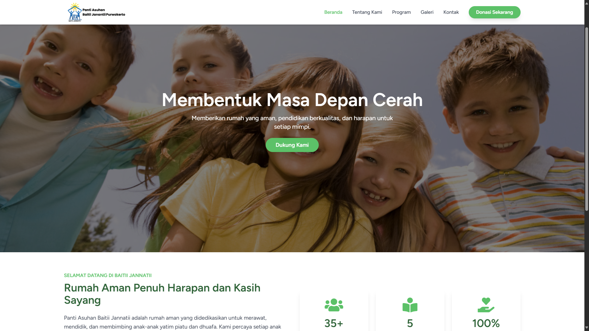

# 🌐 Baitii Jannatii Orphanage Profile Website

This is a university practical work project for the **Design and Implementation of a Profile Website for the Baitii Jannatii Orphanage** located in Purwokerto, Indonesia. This web-based information system was developed to enhance the orphanage's online visibility, provide essential information for potential donors, and serve as a platform for sharing news and activities.



---

## ✨ Key Features

### For Visitors (Frontend)
- **Modern & Responsive Design:** The website layout adapts seamlessly across various devices (desktop, tablet, and mobile).
- **Dynamic Content:** Core content such as the Vision & Mission, contact details, photo gallery, and articles are fully managed by an administrator.
- **Interactive Animations:** Features smooth page transitions (SPA-like experience) and scroll-triggered animations (`AOS.js`) for a more engaging user experience.
- **Photo Gallery:** Showcases the orphanage's activities with a functional lightbox feature.
- **Article System:** Visitors can read the latest news and stories published by the orphanage staff.
- **Contact Form:** A functional form allowing visitors to send messages directly through the website.

### 🔐 For Administrators (Backend)
- **Secure Authentication:** The admin panel is protected by a secure login system.
- **Admin Dashboard:** A central hub for all content management tasks.
- **CRUD for Website Settings:** Admins can easily update core information like the Vision, Mission, Address, and other contact details.
- **CRUD for Gallery Management:** A user-friendly interface to upload new photos and delete old ones.
- **CRUD for Article Management:** A complete system to Create, Read, Update, and Delete articles and news posts.

---

## 💻 Tech Stack

This project is built with a modern and robust tech stack:

- **Backend:** **Laravel 10** (PHP Framework)
- **Frontend:** **Vue.js 3** (JavaScript Framework)
- **Routing & Glue:** **Inertia.js** (for creating a modern, single-page app experience)
- **Styling:** **Tailwind CSS** (Utility-first CSS Framework)
- **Database:** **MySQL**
- **Development Environment:** Vite, XAMPP/Laragon
- **Animation:** AOS (Animate On Scroll)

---

## 🚀 Local Installation & Setup

Follow these steps to run the project in a local environment.

**Prerequisites:**
- PHP >= 8.1
- Composer
- Node.js & NPM
- A MySQL Database

**Steps:**
1.  **Clone this repository:**
    ```bash
    git clone [https://github.com/almasfaiqkh/website-baitii-jannatii.git](https://github.com/almasfaiqkh/website-baitii-jannatii.git)
    ```
2.  **Navigate into the project directory:**
    ```bash
    cd website-baitii-jannatii
    ```
3.  **Install PHP dependencies:**
    ```bash
    composer install
    ```
4.  **Install JavaScript dependencies:**
    ```bash
    npm install
    ```
5.  **Copy the environment file:**
    ```bash
    cp .env.example .env
    ```
6.  **Generate the application key:**
    ```bash
    php artisan key:generate
    ```
7.  **Configure your `.env` file:**
    Update the database connection details (DB_DATABASE, DB_USERNAME, DB_PASSWORD) to match your local setup.

8.  **Run the database migrations and seeders:**
    ```bash
    php artisan migrate:fresh --seed
    ```
9.  **Create the storage symbolic link:**
    ```bash
    php artisan storage:link
    ```
10. **Run the development servers:**
    - In the first terminal: `php artisan serve`
    - In the second terminal: `npm run dev`

11. **Open the application:**
    Access `http://127.0.0.1:8000` in your browser.

---

## 📄 License

This project is licensed under the MIT License.
